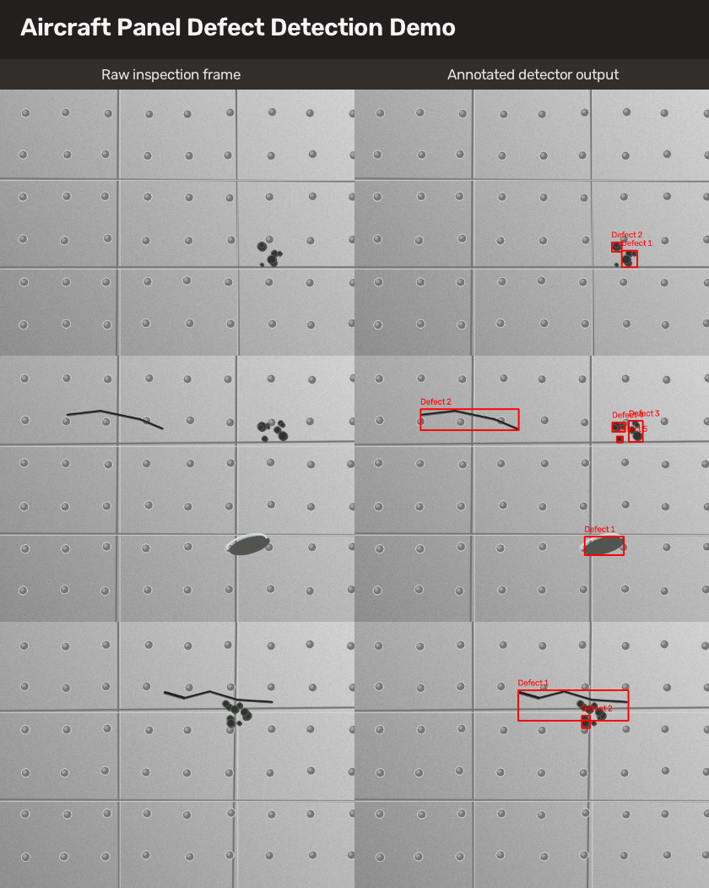

# Aircraft Panel Defect Detector

ROS 2 + OpenCV computer-vision package for detecting aircraft-style panel defects such as scratches, dents, and pitting. The project includes a runnable ROS pipeline, a local non-ROS demo, synthetic image generation, structured detection metadata, CSV logging, and unit tests.

This is built as a portfolio-ready robotics/perception project: the core detector is testable without ROS, while the ROS 2 nodes make it usable in a camera-stream workflow.

## What It Does

- Detects dark scratches, spots, and panel-surface anomalies with OpenCV.
- Draws bounding boxes on annotated output frames.
- Publishes JSON detection metadata with bounding boxes, area, and score.
- Logs detections to CSV for dataset-building and review.
- Provides synthetic aircraft panel images for demos without a physical camera.
- Runs as either a ROS 2 package or a local OpenCV script.

## Demo Output

The local demo generates aircraft panel images, runs the detector, and writes annotated outputs.



The generated demo shows raw inspection frames on the left and annotated detector outputs on the right.

Example metadata:

```json
{
  "frame_id": "panel_000",
  "defect_count": 2,
  "detections": [
    {
      "x": 482,
      "y": 290,
      "w": 28,
      "h": 30,
      "area": 470.5,
      "score": 0.56
    }
  ]
}
```

## Architecture

```text
Image folder or camera topic
        |
        v
/camera/image_raw
        |
        v
DefectDetectorNode
        |
        +--> /defect_detector/annotated_image
        +--> /defect_detector/detections
        +--> defect_detections.csv
```

Core OpenCV logic lives in `aircraft_panel_detector/vision.py`; ROS nodes are thin wrappers around that logic.

## Repository Structure

```text
.
├── aircraft_panel_detector/
│   ├── defect_detector_node.py
│   ├── image_folder_publisher.py
│   └── vision.py
├── docs/
│   ├── assets/demo/
│   ├── portfolio_walkthrough.md
│   └── technical_overview.md
├── launch/
│   ├── detector.launch.py
│   └── synthetic_demo.launch.py
├── scripts/
│   ├── generate_synthetic_panels.py
│   └── run_local_demo.py
├── test/
│   └── test_vision.py
├── package.xml
├── setup.py
└── requirements.txt
```

## Local Demo Without ROS

Use this path if you only want to verify the computer-vision portion.

```bash
python3 -m pip install -r requirements.txt
python3 scripts/run_local_demo.py --output-dir docs/assets/demo --count 3 --seed 21
```

Generated files:

- `docs/assets/demo/raw/`
- `docs/assets/demo/annotated/`
- `docs/assets/demo/inspection_demo.png`
- `docs/assets/demo/detections.csv`
- `docs/assets/demo/detections.json`

Run tests:

```bash
python3 -m pytest test
```

## ROS 2 Setup

Recommended environment: Ubuntu 24.04 with ROS 2 Jazzy.

```bash
sudo apt update
sudo apt install ros-jazzy-desktop python3-colcon-common-extensions \
  ros-jazzy-cv-bridge ros-jazzy-image-transport \
  python3-opencv python3-numpy python3-pytest
```

For Ubuntu 22.04, use ROS 2 Humble and replace `jazzy` with `humble`.

Source ROS:

```bash
source /opt/ros/jazzy/setup.bash
```

## Build In A ROS 2 Workspace

```bash
mkdir -p ~/ros2_ws/src
cd ~/ros2_ws/src
git clone https://github.com/Posiden21/Aircraft-Panel-Defect-Detector.git aircraft_panel_detector
cd ~/ros2_ws
colcon build --packages-select aircraft_panel_detector
source install/setup.bash
```

## Run The Synthetic ROS Demo

Generate sample images:

```bash
cd ~/ros2_ws/src/aircraft_panel_detector
python3 scripts/generate_synthetic_panels.py --count 12 --seed 7
```

Launch the folder image publisher and detector:

```bash
cd ~/ros2_ws
source install/setup.bash
ros2 launch aircraft_panel_detector synthetic_demo.launch.py \
  image_folder:=src/aircraft_panel_detector/datasets/sample_images \
  log_path:=defect_detections.csv
```

View outputs:

```bash
ros2 topic echo /defect_detector/detections
ros2 run rqt_image_view rqt_image_view
```

Select `/defect_detector/annotated_image` in `rqt_image_view`.

## Run With A Real Camera Topic

If another node publishes `sensor_msgs/Image` on `/camera/image_raw`:

```bash
ros2 launch aircraft_panel_detector detector.launch.py
```

Override parameters:

```bash
ros2 launch aircraft_panel_detector detector.launch.py \
  input_topic:=/my_camera/image_raw \
  min_area:=100 \
  dark_threshold:=85 \
  log_path:=logs/defect_detections.csv
```

## Topics

| Topic | Type | Description |
| --- | --- | --- |
| `/camera/image_raw` | `sensor_msgs/Image` | Input camera stream |
| `/defect_detector/annotated_image` | `sensor_msgs/Image` | Image with bounding boxes |
| `/defect_detector/detections` | `std_msgs/String` | JSON detection metadata |

## Detection Approach

The baseline detector uses:

1. Grayscale conversion
2. Gaussian blur
3. Dark-region thresholding
4. Canny edge detection
5. Morphology cleanup
6. Contour filtering
7. Bounding-box annotation

This is a transparent inspection baseline, not a certified aviation model. A natural next step would be replacing or augmenting the OpenCV stage with YOLO, Detectron2, or ONNX inference.

## Portfolio Notes

This project demonstrates:

- ROS 2 package structure
- Computer-vision preprocessing
- Detection metadata design
- Dataset logging
- Synthetic data generation
- Unit testing of perception logic
- GitHub Actions CI

See [docs/technical_overview.md](docs/technical_overview.md) and [docs/portfolio_walkthrough.md](docs/portfolio_walkthrough.md) for more detail.

## License

MIT License.
